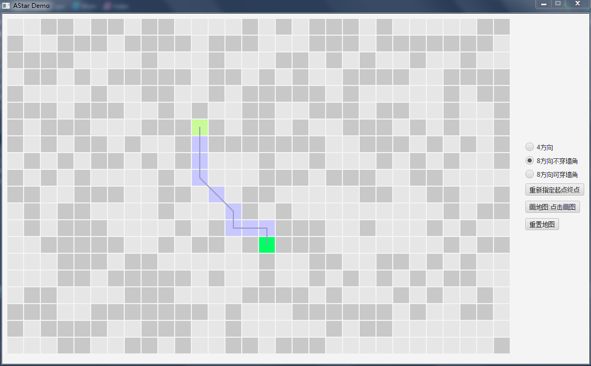

# A*算法Demo

A*算法是游戏中常用的寻路算法。

代码内容 based on Java 8(1.8)

- core 算法代码
  - `AStar.java` 算法实现的基类
  - `AStar4Direction.java` 4方向的实现类
  - `AStar8DirectionNoCrossCorner.java` 8方向不穿墙角的实现类
  - `AStar8DirectionWithCrossCorner.java` 8方向可穿墙角的实现类
- console 控制台演示
- gui 界面演示(JavaFx)
  - 鼠标左键设置格子为起点，鼠标右键设置格子为终点
  - 画地图：鼠标左键设置格子为墙(阻挡区域)，鼠标右键设置格子为路(通行区域)
  - 重置地图：随机生成格子的墙路网格
